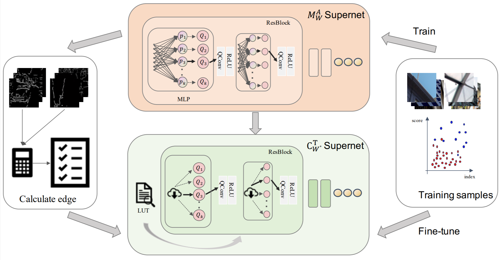

# (CVPR 2023) CABM: Content-Aware Bit Mapping for Single Image Super-Resolution Network with Large Input

This repository is the official implementation of our CVPR2023 paper.
[paper](https://arxiv.org/abs/2304.06454).


Our implementation is based on [CADyQ(PyTorch)](https://github.com/Cheeun/CADyQ) and [PAMS(PyTorch)](https://github.com/colorjam/PAMS).

<p align = "center">

</p>

## Abstract
With the development of high-definition display devices, the practical scenario of Super-Resolution (SR) usually needs to super-resolve large input like 2K to higher resolution (4K/8K). To reduce the computational and memory cost, current methods first split the large input into local patches and then merge the SR patches into the output. These methods adaptively allocate a subnet for each patch. Quantization is a very important technique for network acceleration and has been used to design the subnets. Current methods train an MLP bit selector to determine the propoer bit for each layer. However, they uniformly sample subnets for training, making simple subnets overfitted and complicated subnets underfitted. Therefore, the trained bit selector fails to determine the optimal bit. Apart from this, the introduced bit selector brings additional cost to each layer of the SR network. In this paper, we propose a novel method named Content-Aware Bit Mapping (CABM), which can remove the bit selector without any performance loss. CABM also learns a bit selector for each layer during training. After training, we analyze the relation between the edge information of an input patch and the bit of each layer. We observe that the edge information can be an effective metric for the selected bit. Therefore, we design a strategy to build an Edge-to-Bit lookup table that maps the edge score of a patch to the bit of each layer during inference. The bit configuration of SR network can be determined by the lookup tables of all layers. Our strategy can find better bit configuration, resulting in more efficient mixed precision networks. We conduct detailed experiments to demonstrate the generalization ability of our method.


## Dependencies
* kornia (pip install kornia)
* Python >= 3.6
* PyTorch >= 1.10.0
* other packages used in our code


## Datasets
* For training, we use [DIV2K datasets](https://cv.snu.ac.kr/research/EDSR/DIV2K.tar).

* For testing, we use [benchmark datasets](https://cv.snu.ac.kr/research/EDSR/benchmark.tar) and [Test2K,4K.8K](https://github.com/Cheeun/CADyQ).

```
  # for training
  DIV2K 

  # for testing
  benchmark
  Test2K
  Test4K
```


## How to train CABM step by step
```
# Taking EDSR as an example

# Step-1
# Train full-precision models
sh train_edsrbaseline_org.sh

# Step-2
# Train 8-bit PAMS models
sh train_edsrbaseline_pams.sh

# Step-3
# Train CADyQ models
sh train_edsrbaseline_cadyq.sh

# Step-4
# Get edge-to-bit tables
sh test_edsrbaseline_get_cabm_config.sh

# Step-5
# Get CABM models
sh train_edsrbaseline_cabm_simple.sh
```

## How to test CABM
```
test_edsrbaseline_cabm_simple.sh
```

## How to sample patches while training
You may refer to [SamplingAUG](https://github.com/littlepure2333/SamplingAug).


## Citation
```
@article{Tian2023CABMCB,
  title={CABM: Content-Aware Bit Mapping for Single Image Super-Resolution Network with Large Input},
  author={Senmao Tian and Ming Lu and Jiaming Liu and Yandong Guo and Yurong Chen and Shunli Zhang},
  journal={ArXiv},
  year={2023},
  volume={abs/2304.06454}
}
```

